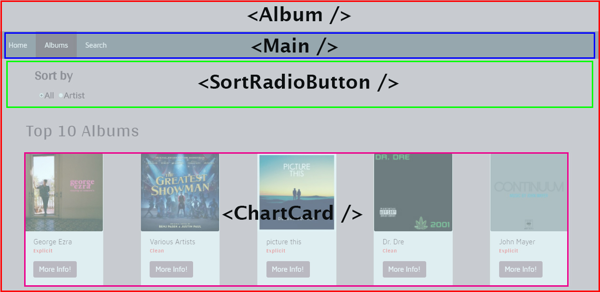

# Deezer API React Application

For this CA, I accessed the Deezer music API and fetched both the singles chart and the albums chart, as well as setting up an Artist Search page to search and fetch the entire API's list of artists.

#### To download, and run this application:

- Create a folder on your system

- Change directory `cd` to that folder in the Node.js Command Line

- `git clone "repository url"`

- Change directory `cd` to cloned respository

- Run `npm install` to install the necessary dependencies and node-modules to work the application

- Run `npm start`

## User Stories
- As a music enthusiast, I would like to view the current Top Ten singles chart

- As a music enthusiast, I would like to view the current Top Ten album chart

- As a music enthusiast, I would like to sort the singles and albums by the artists name to view them alphabetically

- As a music enthusiast, I would like to filter between clean and explicit tracks

- As a music enthusiast, I would like to search the API for all artists

## Wireframes




## Description

This React Application makes use of **imports** to import other components that have been created to be used repeatedly within the application.  Imports within this application also import React and Reactstrap components that the application would like to make use of, for example, Rows, Columns, Modals etc.  This application also required fetchJsonp to be installed using NPM and imported into the main page components, this fetchJsonp was required for the Deezer API to work correctly.  

Imports for this application also imports my CSS code so the styling I have done shows up on the page.

Below is an example of the Home.js imports:

```
import React from 'react';
import fetchJsonp from "fetch-jsonp";
import { Col, Row } from 'reactstrap';
import SortRadioButton from "./SortRadioButton";
import ChartCard from "./ChartCard";
import "../sass/index.css";
```
SortRadioButton and ChartCard are components created to limit DRY code as much as possible.  As I am using the SortRadioButton and the ChartCard components within all three of the main components it was better to seperate the code and import rather than rewriting the same code three times.

**Exports** are used within this application to export components so they can be imported by other components and used.  Each component class created has a corresponding export.  Below is an example of the Home.js component export:

`export default Home;`

**Components** within this application are used to build the application.  The `Main.js` component holds the navigation of the SPA and also imports the three main page components:

```
Home.js
Album.js
Search.js
```
`index.js` imports Main.js, index is the actual SPA page which is made up of all of the above components.  

Smaller components are also used within the application:

```
ChartCard.js
LabelledInput.js
SortRadioButton.js
```
These smaller components were created so they could be used again and again.  ChartCard.js is made up of ReactStrap components, it contains a ReactStrap Card which is responsible for holding the information that the API pulls in.  Reactstrap's Modal is also within ChartCard.js.  This Modal holds extra information about the song or album that has been retrieved.  

LabelledInput.js component holds the search bar that is used within Search.js.  And SortRadioButton.js holds the sort buttons and features.

**State** is used within four components.  Home.js and Album.js contain two states, 'tracks' and 'sort' while Search.js contains an extra state 'searchText'.  These states are declared at the beginning of the page and implemented later in the code.  The 'tracks' state is used to store the fetched API information and the 'sort' state is used to store the sorted information. Within Search.js, 'searchText' is used to store the search information.  

*declaration*
```
this.state = {
  tracks: [],
  sort: 'all'
};
```
*implementation*
```
const list = this.state.tracks
.sort(( a , b ) => {
  if (this.state.sort === 'all') return 0;
  if(a.artist.name < b.artist.name) return -1;
  if(a.artist.name > b.artist.name) return 1;
  return 0;
})
```
ChartCard.js uses state to open and close ReactStrap's modal.  It sets the modal at a closed state until it is toggled and also returns the modal to its previous closed state once it is toggled again.

```
this.state = {
  modal: this.props.modal
};
this.toggle = this.toggle.bind(this);
}
toggle() {
this.setState((prevState) => ({
modal: !prevState.modal
}));
}
```
Once the information from the API is successfully fetched and stored within the 'tracks' state.  I then mapped the information from the state to extract the information from the API that I wanted to use:

```
.map((u, i) => {
  return <User key={i} image={u.album.cover_medium}
  largeImage={u.album.cover_big} albumTitle={u.album.title}
  songName={u.title} artist={u.artist.name}
  position={u.position} lyrics={u.explicit_lyrics}/>;
});
```
Now that map has pulled the information I want to use from the state.  I used **props** to implement them within my application.

```
<ChartCard image={this.props.image}
  artist={this.props.artist}
  lyrics={this.props.lyrics}
  largeImage={this.props.largeImage}
  songName={this.props.songName}
  position={this.props.position}  />
  ```
  The ChartCard component takes in the above mapped information and implements it within a ReactStrap Card.  The props parameters help customize how the mapped information is used.  Using props I am able to wrap the information in a class or place it within a ReactStrap Card.  I can also customize the style of the information with the use of props.

  **Conditionals** are used in this application for the 'sort' feature.  'if' statements are to set the order of the tracks before the sort and afterward:

  ```
  .sort(( a , b ) => {
    if (this.state.sort === 'all') return 0;
    if(a.artist.name < b.artist.name) return -1;
    if(a.artist.name > b.artist.name) return 1;
    return 0;
    ```
  I have also used conditionals to determine if the lyrics within the songs or albums are clean or explicit.  I did this using If/Else.  If/Else within React looks like ? for if and a : for else.

  `{ this.props.lyrics === true ? 'Explicit' : 'Clean' }`

  **BrowserRouter** is used to navigate around the Single Page Application. Within 'Main.js' I have set up the BrowserRouter with Home.js as the landing page.  I also included Album.js and Search.js.  For this to work correctly, all these components are required to be imported into Main.js.  And once set up, Main.js is imported into index.js which is the landing Component for the SPA, the index.js takes in everything from Main.js and also contains the Bootstrap import required for ReactStrap to work.

  ```
  <BrowserRouter>
    <div className="mainHead">
      <ul className="header">
        <li><NavLink exact to="/">Home</NavLink></li>
        <li><NavLink to="/albums">Albums</NavLink></li>
        <li><NavLink to="/search">Search</NavLink></li>
      </ul>
    <div className="content">
      <Route exact path="/" component={Home} />
      <Route path="/albums" component={Albums} />
      <Route path="/search" component={Search} />
    </div>
  </div>
</BrowserRouter>
```

For this CA, I used JavaScript ES6 syntax whenever was appropriate.  For delcaring variables I used `const` and for functions I always implemented them using arrow functions.

For styling I used SASS over CSS as I feel it is a nicer styling language to work with.  This bundle does not come with React's Webpack and therefore I was required to eject the Webpack and implement the SASS loader manually.  

```
{
  test: /\.scss$/,
  loaders: [
    require.resolve('style-loader'),
    require.resolve('css-loader'),
    require.resolve('sass-loader')
  ]
},
```
Webpack handles the processing of the SASS from there.  I ran into issues when I deployed my application to Firebase as there was no external CSS file.  Unlike Gulp.js, Webpack doesn't externalize the processed code, at least not within the React bundle.  To access my processed code, I needed to install extra packages.

```
npm install chokidar
npm install node-chokidar-sass
npm install build-css
npm install start-js
npm install watch-css
```
Chokidar watches the SASS file for changes and updates the new external CSS file.  build-css along with Chokidar creates a external version of the processed code so it can be used when deployed to a server.

The package file to work these installations looks like this:

```
"scripts": {
  "build-css": "node-sass-chokidar src/ -o src/",
  "watch-css": "npm run build-css && node-sass-chokidar src/ -o src/ --watch --recursive",
  "start": "npm-run-all -p watch-css start-js",
  "start-js": "react-scripts start",
  "build": "npm-run-all build-css build-js",
  "build-js": "react-scripts build",
  "test": "node scripts/test.js --env=jsdom"
},
```
Once this process was completed I restarted my react app and within the SASS folder I had now had a index.css file.  Within index.js, I changed my styling import from SCSS to CSS.  I then redeployed my code to Firebase and it was successfully styled.

This CA introduced me to React and the JSX language which I enjoyed using. I learned the importance of seperating components and got more comfortable using an SCSS language in a different format then I am used to.  

The SPA itself runs smoothly without glitches both locally and on the Firebase server.  I am happy with how the modal runs also, it runs smoothly even when the browser is small.  ReactStrap was a nice feature to work with, it brings a nice responsive flow to the application.  

I did not use ReactStrap for the navigation as I could not integrate it with the BrowserRouter.  It kept failing when tested so I resorted to using just the BrowserRouter.  


#### Firebase URL
https://music-lounge-ffd4f.firebaseapp.com
